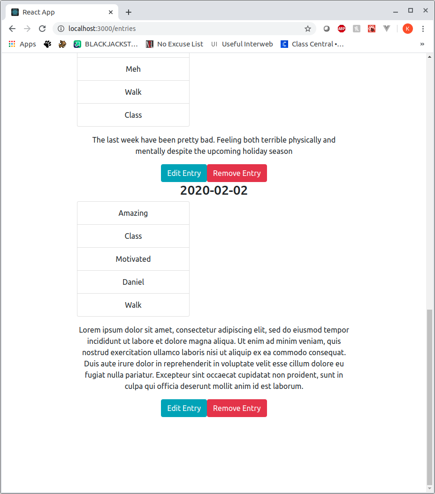

# Data Diary

 - Background
 - User Story
 - Wireframe
 - In Development

## Background
In the past, I've always struggled with depression. It was almost always present as far as I can remember. There would be days I felt helpless, had low energy, and just couldn't find joy in anything. At first it was manageable, but overtime, I could feel myself losing control and it started to consume more and more of my life. At the time, I didn't know what to do or how to ask for help. Eventually I hit a tipping point where I was hospitalized for several days for attempted suicide.

Ever since then, I have developed a strong support network as well as learned different ways to express myself and made some personal adjustments to my life. It took a long time to turn my life around, but at least I was making progress. I still get bouts of depression that I struggle with, but I know that I have people around me that will help me through thick and thin and it has become much more manageable since. 

I created this app for the purpose of not only venting one's emotion, but to provide analysis for one's habits and social circle. With this app, a user can create an entry and then have associated tags/keywords with that entry. The user would then be able to use the tags to conduct an analysis on their entries and see what emotions are generally tied to each activity and person. This would help them conduct an analysis of their life and provide data on what makes them happy and what doesn't. 

With this app, I hope people will be able to not only express their emotions but also to learn more about themselves so that they can make changes that are right for them. 

## User Story: 
A user will have a private account that will not be public in any capacity. The primary activity of the app is to create an entry. This entry could be an emotional vent about an event, or a simple logging of what happened during the day. Each account comes with some default tags such as: Great, Sad, Terrible, Excited etc. Users will also be able to create/edit/delete tags at will.

Each entry will have an associated date as well as tags as chosen by the user. Once the entry is created, it can be viewed, edited, or deleted along with it's associated tags at any point chosen by the user. Users will also have the ability to pull data on any associated tag. Each tag will have a word cloud of all entries that tag is associated in as well as a relational chart of what tags most commonly appear alongside that tag allowing the user to see the relationship between what emotion, activity, person is most commonly associated with.

## Wireframes:

Prototype of Home Page

Prototype of Entry Page

Prototype of Create Entry Page

Prototype of Tags Page

## Features in Development

 - Login/Account functionality
 - Relational Charts

## Tech Stack
Backend uses Express alongside SQLite3 as the database

Frontend uses React, React-Bootstrap, and React-Dom
